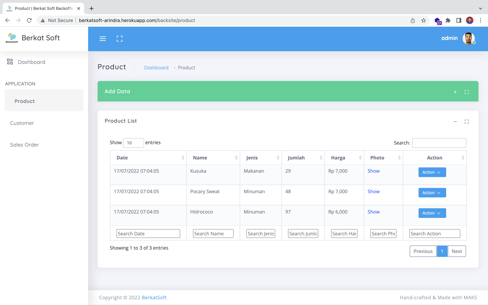

# Berkat-Soft-Recruitment-Test

## task2-laravel

Task Full Stack Developer Laravel

Saya telah membuat project sales order dengan menggunakan laravel jetstream

-   Authentication menggunakan bawaan dari jetstream, untuk tampilan sudah dicustom
-   Menggunakan Eloquent ORM untuk relasi antar table
-   Terdapat File Migration untuk pembuatan table secara otomatis dari laravel
-   Sudah disiapkan file seeder untuk mengisi table

## Preview Project

Landing Page

<div align="center">
  
</div>

---

Back Office <br>
Page Product

<div align="center">
  
</div>

Page Customer

<div align="center">
  
</div>

Page Sales Order

<div align="center">
  
</div>

## Project Setup

```sh
# update document requirement
composer update
```

copy and rename .env.example to .env

config database in file .env

```sh
# generate key
php artisan key:generate

# migrate database
php artisan migrate:refresh --seed

# link storage for access file on server
php artisan storage:link

# run project
php artisan serve
```

### Access from public

access my project at http://berkatsoft-arindra.herokuapp.com/

Default login
username : admin@mail.com
password : Admin@12345
